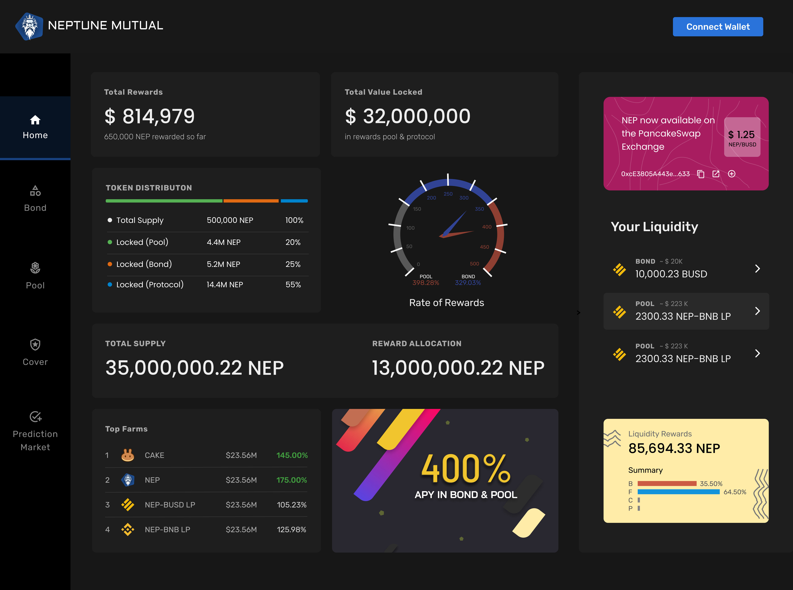

# About Neptune Mutual

The Neptune Mutual platform explores new avenues to creating user-centric hedging products on the blockchain. We aim to attract a new and steady user base and growing liquidity to the Binance Smart Chain by creating stablecoin-based products for accurate risk hedging and coverage.

There is no single entity that controls the future of the Neptune Mutual platform. The platform is conceptualized to democratically incentivize the “good actors” and punish the bad actors.

