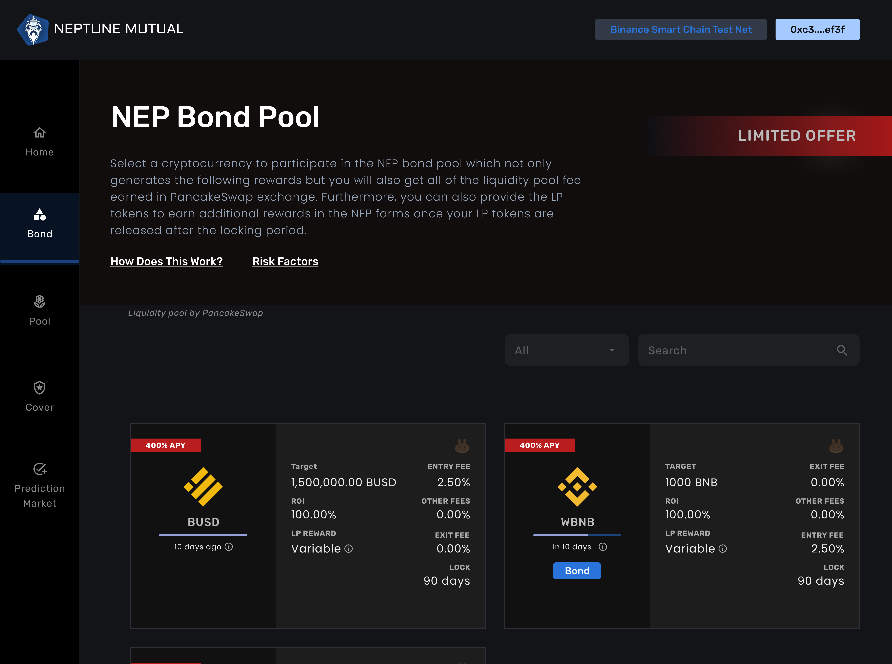

# Locking Period

When you create a bond, you will need to wait for 90 days \(or as suggested in the Bond UI\) to remove the liquidity.

Once your locking period is over, you can then remove your liquidity in the form of PancakeSwap tokens which represent the bond liquidity token and NEP rewards.

