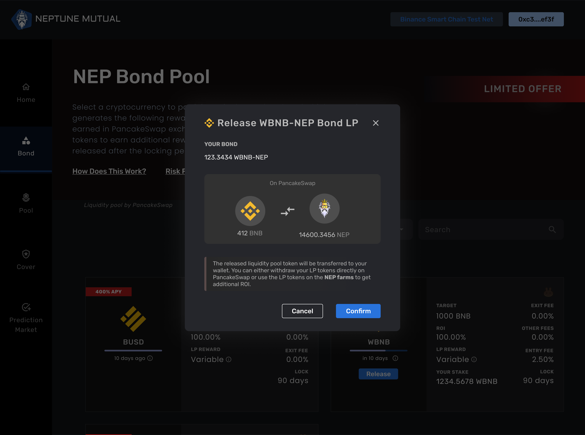

# Releasing the Bond

Once your lockup period is over, the "Release" button on the UI will be activated.

Click on the Confirm Button to withdraw your PancakeSwap LP tokens. The received LP tokens can be farmed in the NEP pool to yield even more NEP rewards. You can also use this LP token to remove liquidity on the PancakeSwap exchange and get back the bond liquidity token and bonded NEP back.

