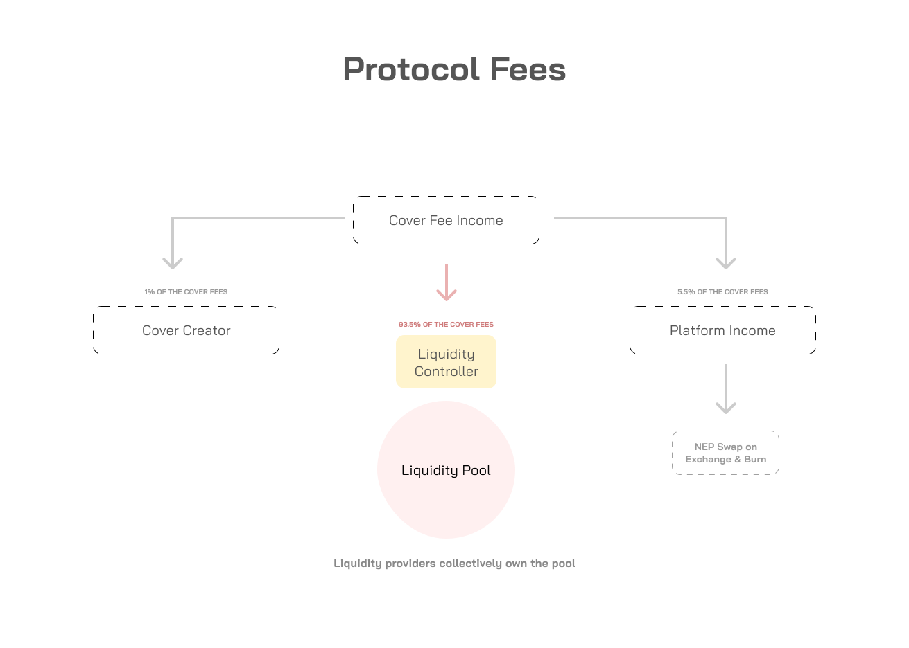

# Protocol Fees

The protocol automatically deducts 6.5% of the fees. A portion of this fee is rewarded to the reporters while the majority of the fee \(in stable coins\) is utilized to purchase NEP tokens from a decentralized exchange. The acquired NEP tokens are then burned, thereby reducing the total supply.

