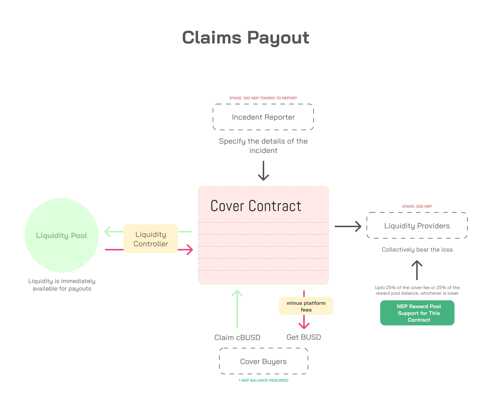

# Purchasing Covers

Anyone who holds 1 NEP token or higher can purchase a cover contract for up to 3 months in the future. No KYC is required.

To guarantee successful claim payout, the platform will restrict liquidity providers from withdrawing the locked assets for a set duration of time \(configurable, governance\).

The realized  \(non-claimable, expired\) cover fees automatically accumulate in the pool. This ensures liquidity providers see their capital grow without having to withdraw.


We will incentivize initial users by airdropping NEP tokens.


