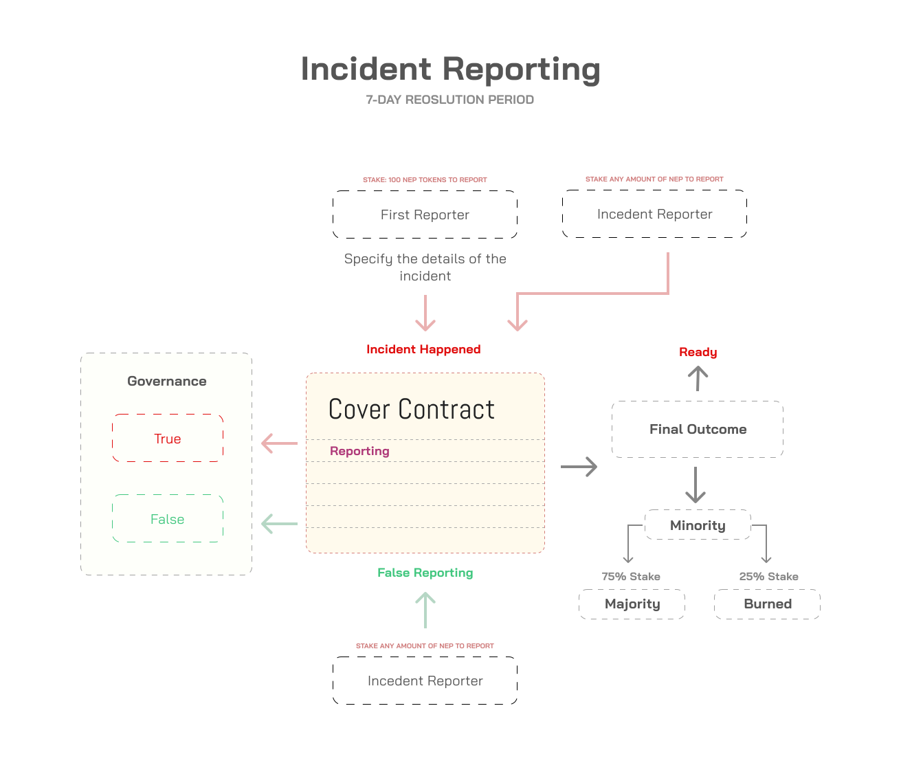

# Reporting

Anyone can report an incident to have happened by staking 100 NEP tokens or higher in the cover contract pool. With this, the contract now becomes open for governance. The locked NEP tokens are added to the reporting pool balance on the "Incident Happened" side. Other people who disagree can also lock any amount of NEP tokens on "False Reporting" side.

This then puts the contract into "Reporting" status. The interested users can still purchase covers \(if liquidity is available\) for the future as the protocol automatically locks liquidity for successful claims in the future.

During the reporting period, users can stake their NEPs to vote. At the end of the reporting period, the side with the majority gets 75% of the minority's stake. The remaining 25% stake is burned.


To encourage competition and fast reporting, the protocol rewards the first reporter with 33% of the total reporting fees. To discourage malicious actors, the platform will burn if the majority disagree with the incident. If this happens, the first user who reported on the other side will get the 33% reward instead.


