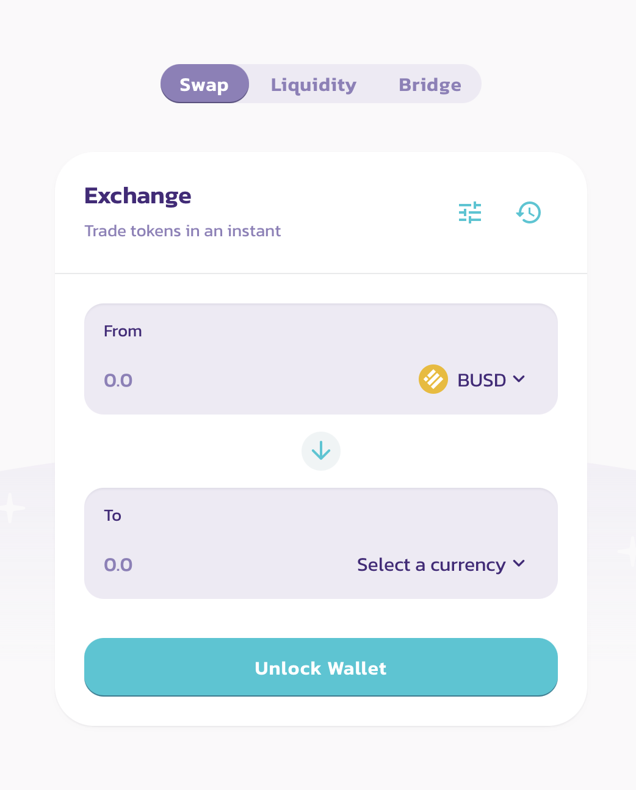
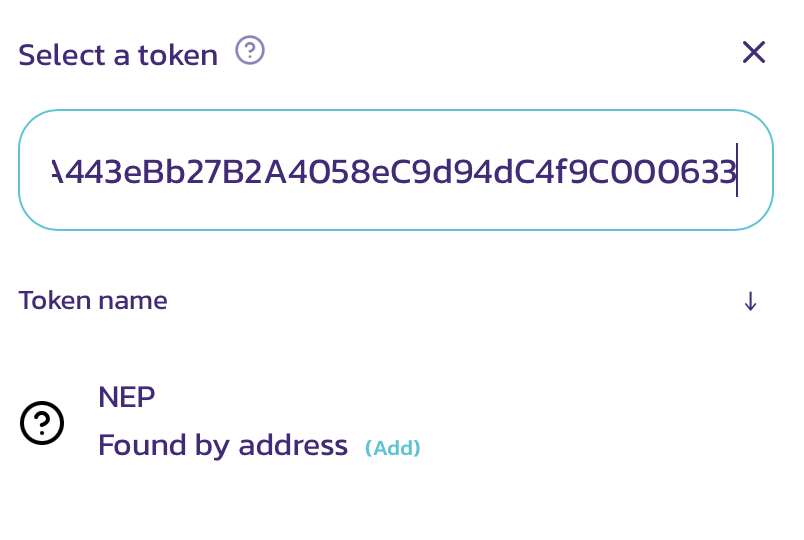
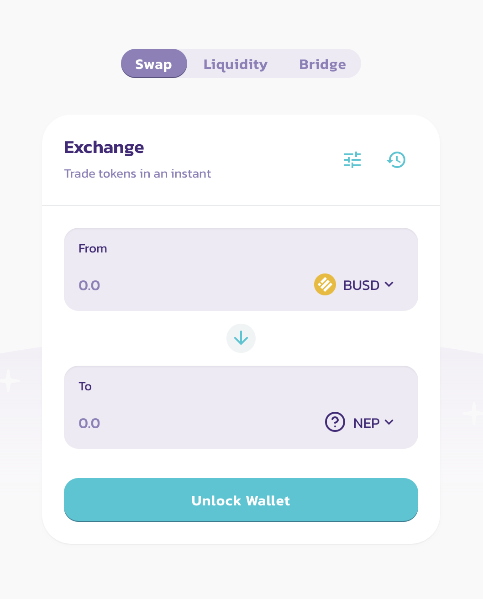

# How to Obtain NEP Tokens?

NEP tokens can be obtained for free as a liquidity reward or directly swapped on the PancakeSwap exchange. 

## How to Obtain NEP Tokens on PancakeSwap?

Go to the PancakeSwap exchange

* [ ] Go to the PancakeSwap app
* [ ] Access the _**Exchange**_ feature
* [ ] On the **From** field, Select BUSD \(or BNB\)

* [ ] Click on the field "Select a currency".

* [ ] Paste the _NEP Token contract address_ in the search field.
* [ ] Click on the link with the text **\(Add\)**.

**NEP Token Address:**  
`0xcE3805A443eBb27B2A4058eC9d94dC4f9C000633`

* [ ] Enter the amount of NEP or BUSD you would like to swap
* [ ] Unlock Wallet if locked and then click on the Swap button


If you're unable to swap NEP tokens, the reason could be lack of liquidity.  Initial NEP token liquidity is getting added to the PancakeSwap exchange. Additionally, check NEP token contract and evaluate the amount of NEP tokens that have been minted.


