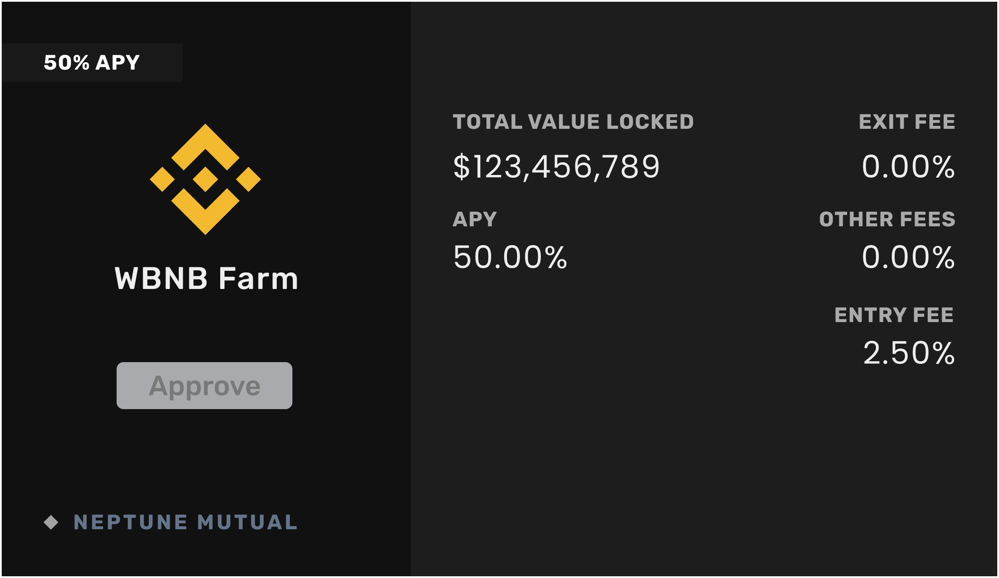
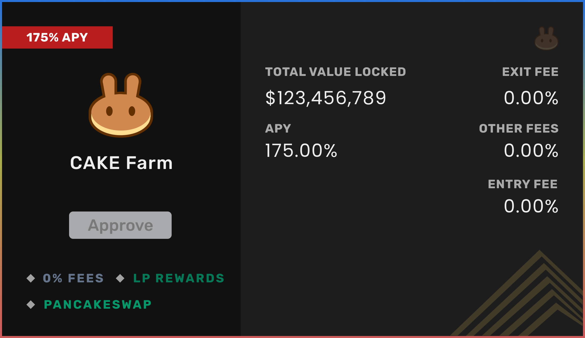

# How Does a Farm Work?

The Neptune Mutual Pool consists of both single asset farm and LP token farm. Each farm has its own allocation and strategy to yield NEP rewards. 

## Single Asset Farm

Directly stake your cryptocurrency in single asset farm to get NEP reward.


Note that there is an entry fee to participate in some farms. In CAKE farm, the deposited assets are farmed in the Syrup pool and the obtained CAKE reward will be used to purchase NEP tokens in the PancakeSwap exchange. The obtained NEP will be burned thereby reducing the total supply.


## LP Token Farm

Obtain LP tokens from the PancakeSwap Exchange. You will not only receive NEP rewards but the LP tokens will also yield additional rewards directly on the PancakeSwap Exchange. 


The Neptune Mutual platform incentivizes the liquidity providers with NEP tokens. The NEP tokens provided here fall under “**Liquidity Pool Rewards**” in our token design. The available tokens in the liquidity pool rewards have a finite supply. The rewards will keep decreasing and farming will eventually be stopped.


