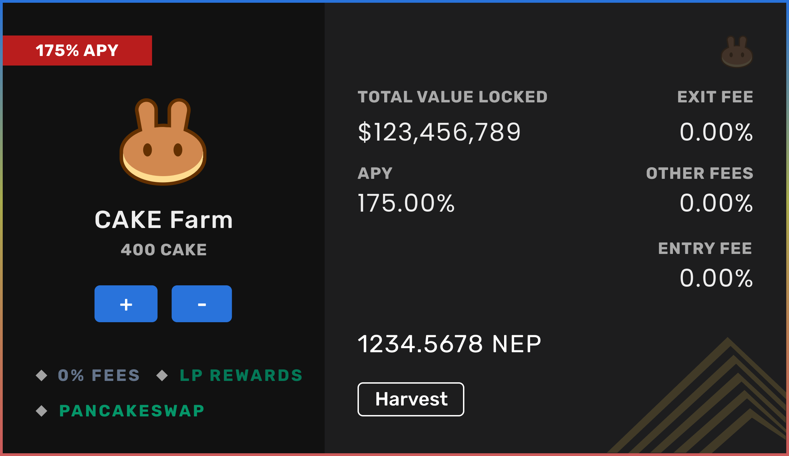

# Removing Liquidity

Click on the minus \(-\) button to remove your liquidity.

Enter the amount of liquidity token you wish to withdraw. To withdraw all staked liquidity, click on the Max button.

Click Confirm to submit the transaction.

