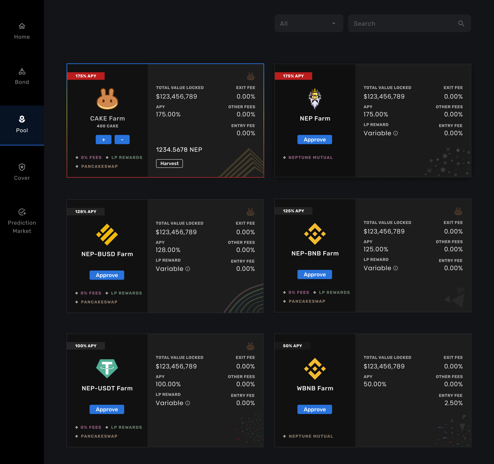

# Pool Introduction

NEP pool consists of single asset and liquidity pair farms. Under single asset farming, you can deposit BNB, CAKE, and NEP whereas you can also deposit NEP-BUSD, NEP-BNB, and NEP-USDT LP tokens from PancakeSwap.

### How to Obtain Tokens for the Farm Pool?

You can obtain both single cryptocurrency and [liquidity pair token](https://exchange.pancakeswap.finance/#/pool) from the PancakeSwap Exchange.





